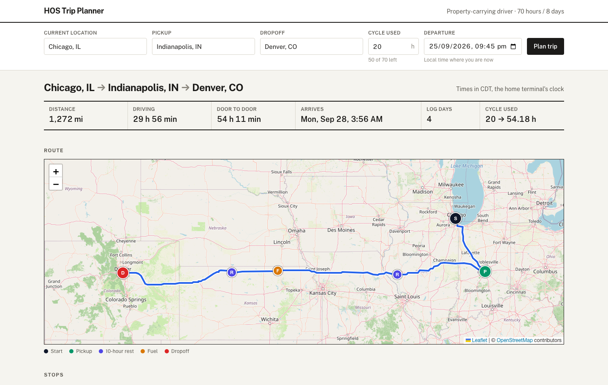

# HOS Trip Planner

A trip planner for property-carrying truck drivers. Enter where you are, where you're picking up, where you're dropping off, and how many hours of your 70-hour cycle you've already used. The app plans the trip under FMCSA Hours of Service rules and returns:

- a map of the truck route with every stop marked: pickup, dropoff, fuel, 30-minute breaks, 10-hour rests and 34-hour restarts
- a timeline of those stops with times and drive legs
- a filled-out Driver's Daily Log sheet for each day of the trip, printable as PDF

**Live app:** _link coming soon_



## Stack

- **Backend:** Django 5, Django REST Framework, Python 3.12
- **Frontend:** React 18, TypeScript, Vite, Tailwind, TanStack Query, react-hook-form + zod, react-leaflet (OpenStreetMap tiles)
- **Routing and geocoding:** [OpenRouteService](https://openrouteservice.org/), using its truck (`driving-hgv`) profile

```
backend/
  trips/hos/       the scheduling engine: plain Python, no Django, no network
  trips/routing/   OpenRouteService client and route geometry helpers
  trips/           API: serializers, views, and services.py which ties them together
frontend/src/
  features/trip-form/   form and location autocomplete
  features/results/     summary, map, stop timeline
  features/logs/        the log sheet SVG and its geometry helpers
docs/              the FMCSA guide, the blank log form and the assessment brief
Dockerfile         one image: builds the frontend, Django serves it next to the API
```

## Running it

You need an OpenRouteService API key (free at openrouteservice.org). All configuration lives in one `.env` at the repo root, which the backend, the frontend and Docker all read:

```sh
cp .env.example .env        # then set SECRET_KEY and ORS_API_KEY
```

### With Docker

```sh
docker compose up --build
```

Open http://localhost:8000, or whatever `APP_PORT` is set to. One container serves both the frontend and the API.

### Deploying to Render

The same image is what gets deployed. `render.yaml` describes the service for Render's free plan:

1. Push the repo to GitHub.
2. In Render, choose **New > Blueprint** and pick the repo.
3. Enter `ORS_API_KEY` when prompted. Leave the map tile variables empty unless you have a tile provider key.

Render generates `SECRET_KEY`, the service's `*.onrender.com` hostname is trusted automatically, and it health-checks `/api/health/`. Free services sleep when idle, so the first request after a quiet spell takes a while; an uptime monitor pinging `/api/health/` every 10 minutes keeps it awake.

Any other container host works the same way: set `SECRET_KEY`, `ALLOWED_HOSTS` and `ORS_API_KEY`, plus `PORT` if the host assigns one and `WEB_CONCURRENCY` (default 2) to size the workers.

### For development

Backend:

```sh
cd backend
python3.12 -m venv .venv
source .venv/bin/activate
pip install -r requirements-dev.txt
python manage.py runserver
```

Frontend, in a second terminal:

```sh
cd frontend
npm install
npm run dev
```

Open http://localhost:5173. Vite forwards `/api` to the backend on port 8000, so the browser talks to one origin in development too.

## Environment variables

| Variable | Used by | Purpose |
| --- | --- | --- |
| `SECRET_KEY` | backend | Django secret key. Required. |
| `DEBUG` | backend | `True` for local development. Defaults to `False`. |
| `ALLOWED_HOSTS` | backend | Comma-separated hostnames. |
| `ORS_API_KEY` | backend | OpenRouteService key. Never sent to the browser. |
| `SECURE_SSL_REDIRECT` | backend | Defaults to on when `DEBUG` is off. Turn off only for plain-HTTP local runs. |
| `CORS_ALLOWED_ORIGINS` | backend | Only needed if the frontend is hosted on a different origin from the API. |
| `VITE_API_URL` | frontend | API base URL. Leave empty when the frontend and API share an origin. |
| `VITE_MAP_TILE_URL`, `VITE_MAP_TILE_ATTRIBUTION` | frontend | Map tile source. Empty uses OpenStreetMap's tile servers; set a keyed provider for production traffic (example in `.env.example`). |
| `WEB_CONCURRENCY` | docker | Gunicorn worker processes, about 60 MB each. Defaults to 2. |
| `CACHE_DIR` | backend | Where geocoding results are cached. Defaults to `backend/.cache`; Docker keeps it in a volume. |
| `APP_PORT` | docker | Host port for `docker compose`. Defaults to 8000. |

## API

- `POST /api/trips/plan/` takes `current_location`, `pickup_location`, `dropoff_location`, `current_cycle_used_hours` (0 to 70) and an optional `start_time` (wall-clock time at the current location, e.g. `2026-09-26T08:00`). It returns the route as a GeoJSON LineString, a summary, the ordered stops and one daily log per day. Timestamps are ISO 8601 with the home terminal's offset.
- `GET /api/geocode/search/?q=...` returns place suggestions for the location dropdowns.
- `GET /api/geocode/reverse/?lat=...&lon=...` names the browser's position for "Use my location". `label` is null when the place can't be named; the form then fills in the coordinates, which the planner accepts as a location (`41.8781, -87.6298`) without a geocoding call.

Errors always look like `{"error": {"code", "message", "fields"}}`. A location that can't be found comes back as a 400 with the message on that field.

## Hours of Service rules

Source: FMCSA *Interstate Truck Driver's Guide to Hours of Service* (April 2022), 49 CFR 395. The limits live in `backend/trips/hos/rules.py`.

| Rule | What the planner does |
| --- | --- |
| 11-hour driving limit, 395.3(a)(3) | At most 11 hours of driving after 10 consecutive hours off. |
| 14-hour window, 395.3(a)(2) | No driving after the 14th hour since coming on duty. On-duty work, such as a dropoff, can still finish after it. |
| 30-minute break, 395.3(a)(3)(ii) | No driving after 8 cumulative hours of driving without 30 consecutive non-driving minutes. Any mix of on duty, off duty or sleeper counts, so a pickup or fuel stop clears it and no extra break is added. |
| 10-hour reset, 395.3(a)(1) | 10 consecutive hours in the sleeper berth reset the 11- and 14-hour limits. |
| 70-hour/8-day cycle, 395.3(b) | The driver drives until on-duty time reaches 70 hours, then takes a 34-hour restart, 395.3(c), which resets the cycle to 0. |
| Fuel | A fuel stop before the miles since the last fill-up pass 1,000. |

Resets are worked out from the time actually logged, not from which kind of stop the planner chose, so they can't drift apart.

## Assumptions

From the assessment:

- Property-carrying driver on the 70-hour/8-day cycle, no adverse driving conditions, no short-haul exceptions
- 1 hour on duty for pickup and 1 hour for dropoff
- Fuel at least every 1,000 miles

Added by me:

- **Start of trip:** the driver starts rested, with a fresh 11/14-hour shift. The form only asks for cycle hours, not hours already worked today.
- **Fuel stop:** 30 minutes, on duty not driving. If a 30-minute break falls due within 250 miles of needing fuel, the driver fuels instead, and that one stop covers both.
- **Inspections:** a 30-minute pre-trip at the start of every shift and a 15-minute post-trip at the end of the trip, like the sample day in the guide.
- **Drive times:** taken from the routing service's truck profile, not a flat average speed.
- **Rests:** 10 consecutive hours in the sleeper berth. A 34-hour restart is logged as off duty.
- **Log day and timezone:** each log runs midnight to midnight on the clock of the current location, which stands in for the home terminal. That UTC offset is fixed for the whole trip so every sheet is exactly 24 hours, even across a daylight-saving change.
- **Start time:** defaults to now, rounded up to the next 15 minutes, and can be changed in the form.
- **Log sheet drawing:** the duty line snaps to 15-minute marks, as on paper, and the totals column adds up those drawn quarter hours so it always agrees with the line and sums to 24. The API returns exact minutes.

## Known limitations

- **No per-day cycle history.** The app only knows the total cycle hours used, not how they break down by day, so it can't work out hours rolling off the 8-day window. It uses a 34-hour restart instead, which is conservative. The recap on each sheet follows the same approach.
- **No split sleeper berth.** Rests are always a full 10 hours. The planner has a single place where the 7/3 and 8/2 pairings from 395.1(g) could be added.
- **Routing speeds.** The truck profile's travel times are conservative (roughly 40 to 45 mph on long hauls), and it is not a commercial truck-routing service, so restrictions such as low bridges are best effort.
- **Remark locations.** Stops get the nearest town from reverse geocoding. On empty stretches of highway there may be no town nearby, so the remark shows the road and county instead, e.g. "US 66, Guadalupe County, NM".
- **US only.** Location search is limited to the United States, where these rules apply.
- **Routing quota.** OpenRouteService's free tier has daily quotas per endpoint. Geocoding results are cached for a week to spare them, and once an endpoint reports its quota is spent the app stops calling it for 15 minutes: stops fall back to coordinates, and a new trip gets a clear "daily limit reached" error.
- **Map tiles.** By default the map uses OpenStreetMap's volunteer tile servers, which are fine for light use only. A production deployment should set `VITE_MAP_TILE_URL` to a keyed provider.

## Tests

```sh
cd backend && pytest
cd frontend && npm test
```

- **Engine:** has a test for each limit: a short trip, a 30-minute break, the 11-hour limit, the 14-hour window, a 2,500-mile trip, and a starting cycle of 65 hours that forces a restart.
- **Compliance check:** 400 seeded random trips are replayed through an independent compliance checker (`backend/tests/hos/compliance.py`), which fails if any rule is ever broken.
- **Daily logs:** every day must total exactly 24 hours, including partial first and last days.
- **API tests:** run with the routing client mocked, so they need no network.
- **Frontend tests:** cover the form, the autocomplete, the log sheet geometry helpers and the rendered sheet.

Linting and formatting: `ruff check . && ruff format --check .` in `backend/`, and `npm run lint && npm run format:check` in `frontend/`. CI runs all of these, plus a production build, on every push.
